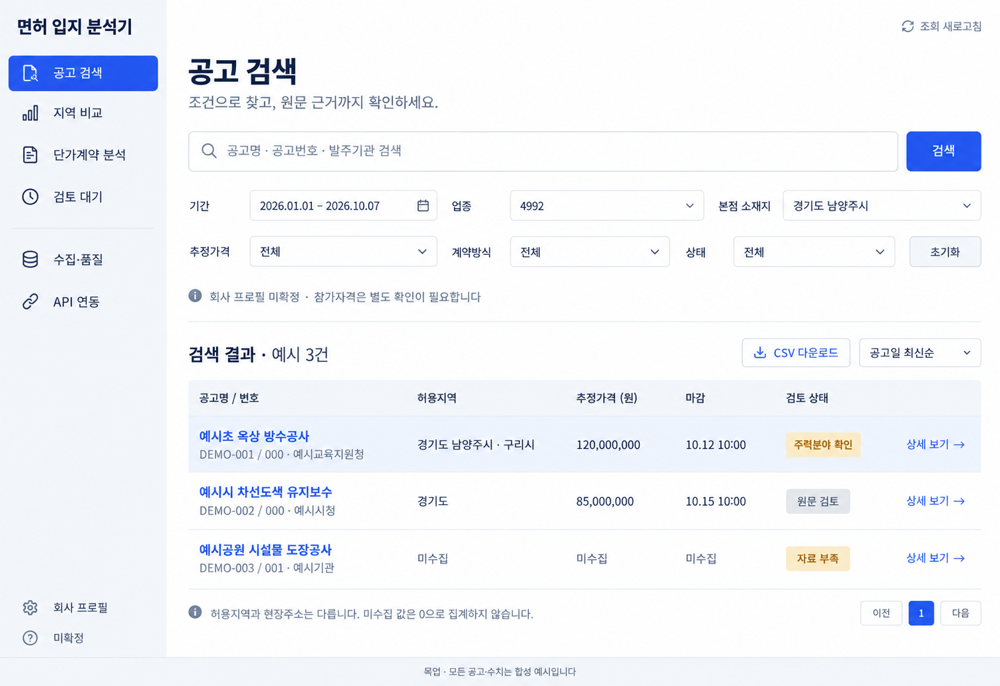
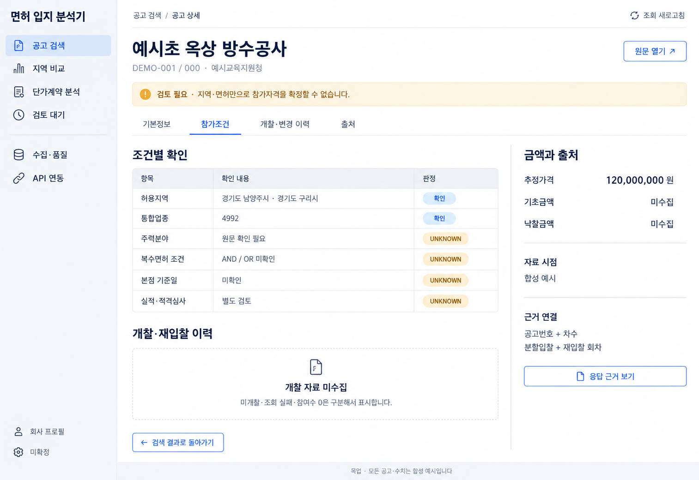
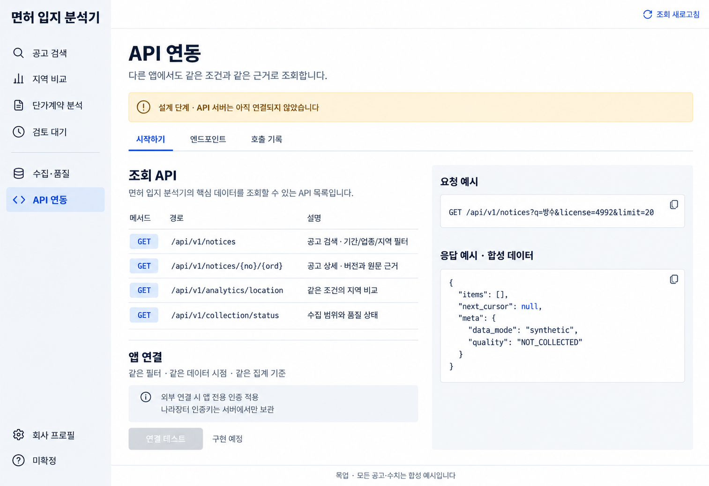
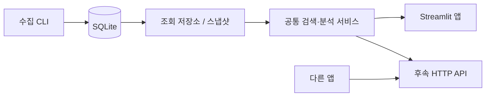

# 실행형 앱 목업 v1

작성일: 2026-10-08. 사용자의 요청은 **목업 먼저**, 저장된 실데이터 조회·검색, 이후 다른 앱에서 호출할 수 있는 API, 비공개 GitHub 저장소 업로드다.

이 디렉터리는 사용자가 채택한 **디자인 시안**이다. 후속 지시 “목업처럼 만들어. 디테일은 나중에”에 따라 `app.py`의 실행형 Streamlit 앱으로 구현했다. 기존 HTML 보고서는 파일 기반 스냅샷이며 실행형 앱과 구분한다. 조회 HTTP API는 아직 구현하지 않았다. 아래 그림의 공고와 수치는 모두 합성 예시이고, 실제 앱은 DB에 저장된 실데이터를 사용한다. 실제 데이터가 없을 때 예시로 자동 대체하지 않는다.

## 화면

### 1. 공고 검색

검색어 → 기간·업종·본점·추정가격·계약방식·상태 필터 → 결과 표 → 공고 상세로 이어진다. 적용된 조건과 데이터 시점을 보존하고 CSV를 내려받는다. 본점 필터는 허용지역 조건을 사용하며 현장주소를 대신 쓰지 않는다. 초기 회사 프로필은 미확정이다.

### 2. 공고 상세

공고번호·차수로 선택한 공고의 조건, 금액 종류, 개찰·변경 이력, 출처를 확인한다. 통합업종 확인과 주력분야·복수면허 AND/OR·본점 기준일·적격심사 검토를 분리한다. 자료가 없는 항목은 UNKNOWN 또는 미수집으로 표시한다. 개찰 이력은 분할입찰·재입찰 회차를 보존한다.

### 3. API 연동

다른 앱이 검색·상세·지역 분석·수집 상태를 요청하는 후속 기능이다. 목업의 경로는 **제안 계약**이며 실제로 제공 중인 endpoint가 아니다. 연결 테스트·인증 발급은 구현 전까지 사용할 수 없게 표시한다. 나라장터 serviceKey와 앱 소비자용 인증은 분리한다.

## 전체 탐색 구조

| 메뉴 | 목적 | 이번 시안 범위 |
|---|---|---|
| 공고 검색 | 제목·번호·기관 검색, 조건 필터, 다운로드 | 독립 화면 이미지 |
| 공고 상세 | 조건·금액·회차·근거 추적 | 독립 화면 이미지 |
| 지역 비교 | 동일 코호트의 표본·연결률·참여수 비교, 근거 공고 드릴다운 | 탐색 메뉴와 동작 설계, 개별 화면은 다음 시안 |
| 단가계약 분석 | 사업연도·분류·기관별 예산 통계 | 탐색 메뉴, 개별 화면은 다음 시안 |
| 검토 대기 | UNKNOWN·충돌·누락 이유별 필터 | 탐색 메뉴, 개별 화면은 다음 시안 |
| 수집·품질 | 완료 기간·오류·시점·분모 확인 | 탐색 메뉴, 개별 화면은 다음 시안 |
| API 연동 | 요청 계약·앱 연결·호출 진단 | 독립 화면 이미지, 후속 개발 |

별도 점수·추천 순위·낙찰확률·기대매출은 만들지 않는다. 전국 고유 공고 수를 입지별 중복 합계로 대신하지 않는다.

## 시각 기준

- 바탕은 흰색, 사이드바는 옅은 회색, 본문은 짙은 남색, 주요 동작은 파란색이다. 경고는 호박색과 문구를 함께 쓴다.
- 표·필터·근거가 중심이다. 지도, 홍보 영역, 장식용 지표 카드, AI 채팅은 추가하지 않는다.
- 글꼴은 한국어 가독성을 우선한다. 구현 시 Pretendard 또는 시스템 한국어 글꼴을 사용하고 숫자는 우측 정렬한다.
- 작은 화면에서는 메뉴를 접고 필터를 세로 배치한다. 결과는 핵심 열과 상세 진입을 우선하며 모바일 시안은 아직 검증하지 않았다.
- 이미지는 디자인 참고 자료다. 실제 앱의 텍스트·입력·표·버튼은 Streamlit의 코드 기반 UI로 구현한다.

## 구현 구조 제안

기존 `analysis.py`, `repositories`, `exports.py`를 재사용한다. 검색의 필터·정렬·페이지네이션을 공통 서비스에 두고, UI와 API가 같은 입력 계약과 결과 모델을 사용한다. API가 Streamlit 화면을 긁거나 HTML에 내장된 JSON을 읽는 구조로 만들지 않는다.

UI 새로고침은 저장된 데이터만 조회한다. 수집은 별도 CLI로 실행하며 사용자 동작이나 Streamlit rerun이 실제 API 호출을 시작하지 않는다. DB 읽기는 일관된 읽기 트랜잭션을 사용하고, 데이터 버전별 캐시·명시적 새로고침·페이지네이션으로 대용량 결과 전체를 매번 브라우저에 보내지 않는다.

현재 면허 분석은 4992만 검증되었다. 임의의 업종을 지원한다고 표시하지 않고, 확장 전에 해당 API 계약·응답과 분석 조건을 확인한다. 전체 공고 검색과 검증된 면허 분석의 제공 범위를 UI에서 구분한다.

후속 HTTP 계층은 Python ASGI/FastAPI 같은 얇은 어댑터를 검토한다. 이번에는 조회 API 서버를 만들지 않았다. Streamlit 앱은 127.0.0.1에만 바인딩한다. 원격 앱 연결은 인증·접근 범위·TLS·호출 제한을 설계한 후 별도 배포 단계에서 다룬다.

## API 계약 초안 — 미구현

| 요청 | 제공할 내용 |
|---|---|
| `GET /api/v1/notices` | 검색어, 날짜, 면허, 허용지역, 계약방식, 금액, 상태, 정렬, 커서 기반 목록 |
| `GET /api/v1/notices/{no}/{ord}` | 해당 복합키의 상세, 지역 집합, 면허 조건, 회차별 개찰, 품질, 출처 ID |
| `GET /api/v1/analytics/location` | 같은 기간·업종·금액·계약방식·프로필의 지역별 지표와 분모 |
| `GET /api/v1/collection/status` | 저장된 수집 범위, 완료/부분 상태, 오류, 마지막 데이터 시점 |

모든 응답은 적용 필터, 데이터 시점, 스냅샷 식별자, 품질 상태를 포함한다. 목록 커서는 스냅샷과 정렬키에 묶어 도중에 데이터가 갱신돼도 페이지 중복·누락을 막는다. 잘못된 필터, 미수집, 부분 수집, 빈 검색 결과, 서버 오류를 서로 다른 상태로 처리한다. 금액의 null과 0을 구분한다. 원본 API 요청 URL·인증키는 응답에 포함하지 않는다.

읽기 전용 앱 인증을 나라장터 키와 별도로 관리한다. 원격 연결이 필요해지면 앱별 폐기·교체·권한을 지원하고 키 원문은 최초 발급 외에는 표시하지 않는 방향으로 설계한다. API 호출로 외부 원천 수집을 자동 실행하지 않는다.

## 다음 구현·검증

1. 목업 피드백 반영 및 지역 비교·단가·품질 화면을 같은 디자인으로 구체화한다.
2. 공통 검색 서비스와 실제 Streamlit 앱을 구현해 DB의 결과·필터·상세·다운로드를 연결한다.
3. 빈 DB, 부분 수집, 오류, null, 정정·재공고·재입찰을 검증한다. UI rerun에서 네트워크 수집이 0회인지 확인한다.
4. 실제 브라우저에서 검색·상세·다운로드·새로고침과 PC/모바일을 검증한다.
5. 후속 API 어댑터에 같은 필터 계약을 적용하고 UI/API 결과 일치, 인증, 페이지 경계를 검증한다.

실행형 앱의 최신 검증 결과는 `../VALIDATION_REPORT.md`를 참조한다. 기존 분석·수집 테스트 통과를 새 앱 완성 근거로 사용하지 않으며, 조회 HTTP API는 미구현이다.

## 이미지 생성

내장 `image_gen` 도구를 사용했다. 최종 생성 프롬프트는 [prompts.json](prompts.json)에 보관한다. 최종 이미지는 이 폴더에 복사하며 계정 기본 이미지 폴더의 경로에 의존하지 않는다.
